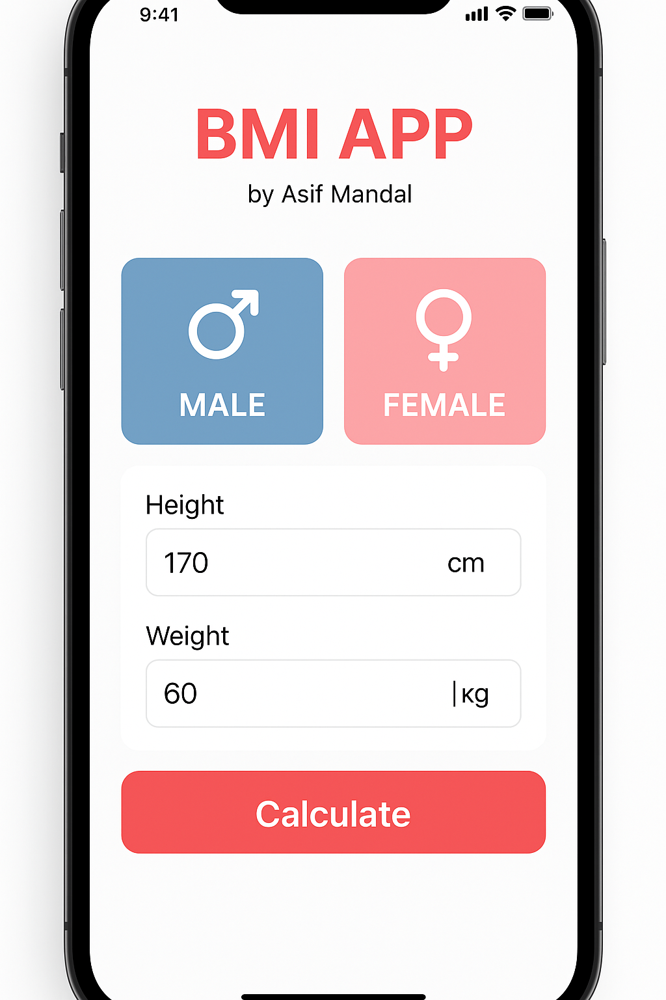
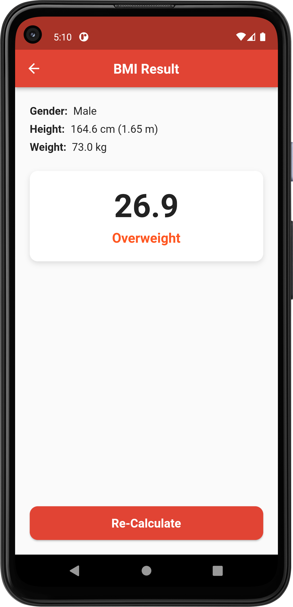
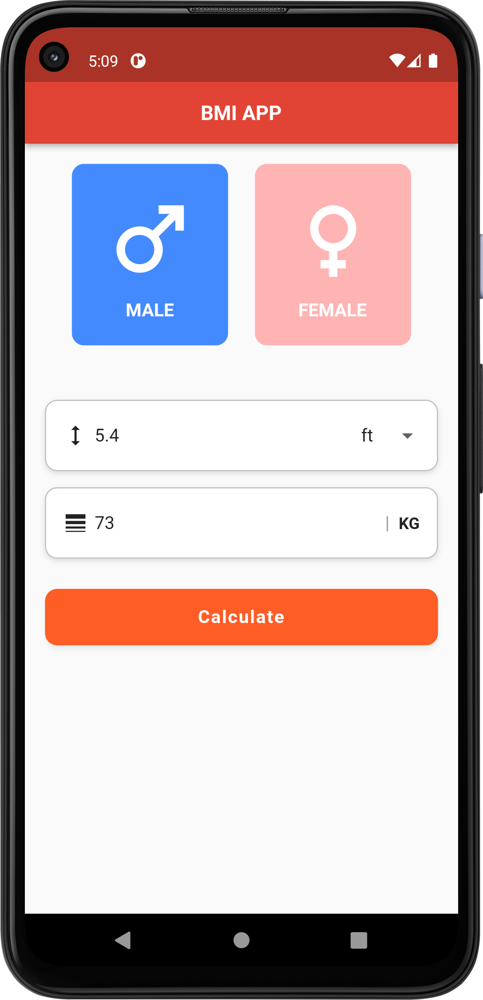

# 🧮 BMI Calculator App (Flutter)

A beautifully designed **BMI Calculator App** built using Flutter.  
This app allows users to calculate their Body Mass Index (BMI) by entering their height and weight, with support for different units (cm, inch, feet).





---

## 🚀 Features

- 🔘 Gender selection (Male/Female)
- 📏 Height input with unit options: cm, inch, feet
- ⚖️ Weight input (kg)
- ✅ Unit conversion logic handled internally
- 🧠 Accurate BMI calculation and classification
- 📊 Result screen with BMI value and category
- 🎨 Modern UI with customizable theme and colors

---

## 🛠️ Getting Started

### 🔧 Prerequisites
- [Flutter SDK](https://flutter.dev/docs/get-started/install)
- Android Studio / VS Code
- Android/iOS device or emulator

### ▶️ Run the app

```bash
git clone https://github.com/ASIF-MANDAL/BMI_Calculator.git
cd BMI_Calculator
flutter pub get
flutter run
